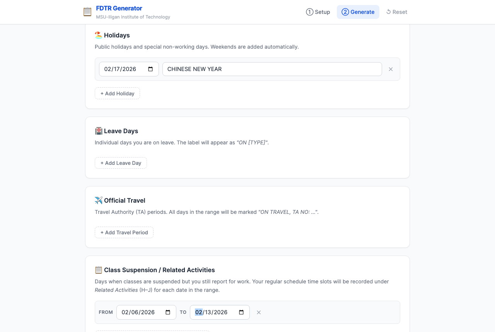
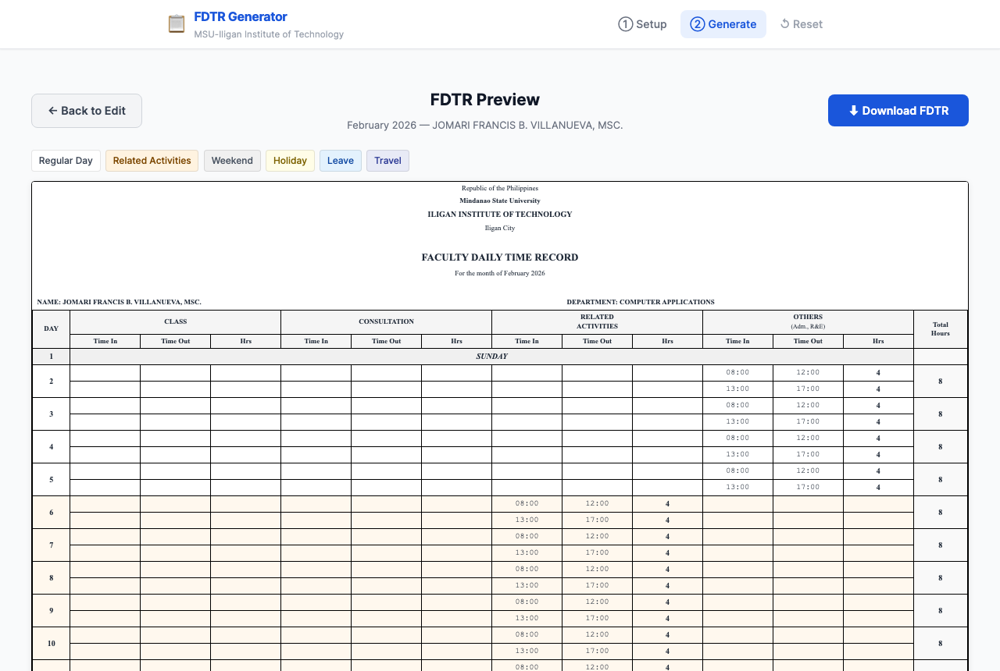
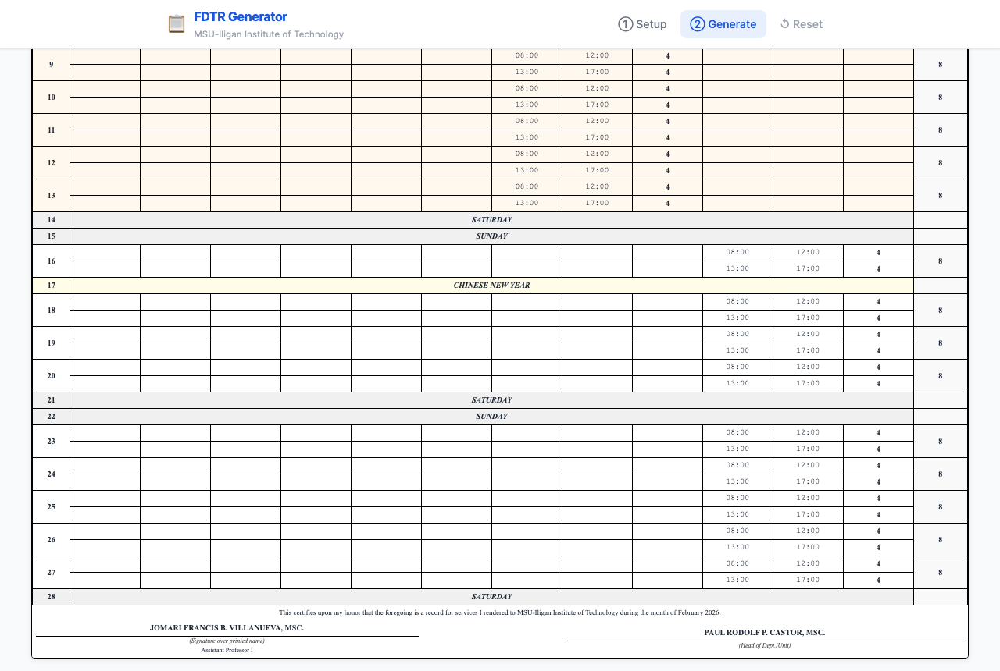

# 📋 FDTR Generator

**Faculty Daily Time Record generator for MSU-IIT faculty.**
Fill in your profile once, then generate a correctly-formatted FDTR Excel file for any month in seconds — preview it in the browser before you download.


---

## ✨ Features

| Feature | Description |
|---|---|
| **Profile setup** | Enter your name, designation, department, and department head once — saved for the session |
| **Weekly schedule builder** | Define time slots per weekday with category (Class, Consultation, Related Activities, Others) |
| **Holidays** | Mark public/special non-working days with a custom label |
| **Leave days** | Tag individual days as Sick Leave, Vacation Leave, etc. |
| **Official Travel** | Enter Travel Authority (TA) number and date range; all days are auto-labelled |
| **Class Suspension / Related Activities** | Date ranges where classes are suspended but faculty still reports — time is logged under the *Related Activities* columns |
| **Live preview** | Color-coded HTML table in the browser before you download |
| **Excel output** | Exact MSU-IIT FDTR format — Times New Roman font, correct borders, column widths, merged cells |

---

## 📸 Screenshots

### Step 1 — Faculty Profile & Weekly Schedule


### Step 2 — Configure Month, Holidays & Special Days


### Step 3 — Preview Before Downloading




---

## 🚀 Quick Start

### Prerequisites

- Python **3.11** or later
- `pip` (comes with Python)

### 1 — Clone the repository

```bash
git clone https://github.com/JomVill/fdtr-generator.git
cd fdtr-generator
```

### 2 — Create a virtual environment

```bash
python -m venv venv
source venv/bin/activate        # macOS / Linux
# venv\Scripts\activate         # Windows
```

> **macOS note:** If your project folder path contains a colon (`:`), create the venv
> outside the project:
> ```bash
> python -m venv ~/Developer/fdtr_venv
> source ~/Developer/fdtr_venv/bin/activate
> ```

### 3 — Install dependencies

```bash
pip install -r requirements.txt
```

### 4 — Configure environment

```bash
cp .env.example .env
# Open .env and set a strong SECRET_KEY for production
```

### 5 — Run the app

```bash
python app.py
```

Open your browser at **http://localhost:5050**

---

## 🗺️ How to Use

### Step 1 — Set up your profile

Fill in your faculty information and weekly schedule. Each time slot needs a **Time In**, **Time Out**, and a **category**:

| Category | Excel Columns | Typical Use |
|---|---|---|
| Class | B – D | Teaching hours |
| Consultation | E – G | Student consultation |
| Related Activities | H – J | Admin work, research, etc. |
| Others (Adm., R&E) | K – M | Other duties |

Click **Save Profile & Go to Generate →** when done.
Your profile is **saved for the entire session** — you only need to enter it once.

---

### Step 2 — Generate a month

Select the **month** and **year**, then add any special days:

#### 🏖 Holidays
Click **+ Add Holiday**, pick the date, and type the label (e.g. `RIZAL DAY`).
Weekends are added automatically — you don't need to enter them.

#### 🏥 Leave Days
Click **+ Add Leave Day**, pick the date, and select the leave type from the dropdown (Sick Leave, Vacation Leave, etc.).

#### ✈️ Official Travel
Click **+ Add Travel Period**, set the date range, and enter the TA number.
Every day in the range is automatically labelled `ON TRAVEL, TA NO: …`.

#### 📋 Class Suspension / Related Activities
For days when classes are suspended but you still report for work:
Click **+ Add Suspension / Related Activity Period** and set the date range.
Your regular weekly schedule is used, but all time slots are recorded under the **Related Activities** (H–J) columns instead of their usual columns.

Click **👁 Preview FDTR** when done.

---

### Step 3 — Preview and Download

The preview page shows a **color-coded table** that matches the Excel output:

| Color | Day Type |
|---|---|
| ⬜ White | Regular working day |
| 🟠 Light orange | Related Activities (class suspension) |
| ⬛ Light gray | Saturday / Sunday |
| 🟡 Light yellow | Holiday |
| 🔵 Light blue | Leave day |
| 💜 Light indigo | Official Travel |

If everything looks correct, click **⬇ Download FDTR** — the `.xlsx` file downloads immediately.
If you spot an error, click **← Back to Edit** to return and fix it without losing your data.

---

## 📁 Project Structure

```
fdtr-generator/
├── app.py                  # Flask routes (setup, generate, preview, download)
├── fdtr/
│   ├── __init__.py
│   └── generator.py        # Excel generation + HTML preview data
├── templates/
│   ├── base.html
│   ├── setup.html          # Step 1 — profile & weekly schedule
│   ├── generate.html       # Step 2 — month, holidays, special days
│   └── preview.html        # Step 3 — preview table + download
├── static/
│   ├── css/style.css
│   └── js/app.js
├── requirements.txt
├── Procfile                # Railway.app / Heroku deployment
├── .env.example
└── LICENSE
```

---

## ☁️ Deployment (Railway.app)

1. Push the repo to GitHub (already done).
2. Go to [railway.app](https://railway.app) → **New Project** → **Deploy from GitHub repo**.
3. Select `fdtr-generator`.
4. In the Railway dashboard, add an environment variable:
   ```
   SECRET_KEY=<your-strong-random-key>
   ```
5. Railway auto-detects the `Procfile` and deploys. Your app will be live at the assigned `.railway.app` URL.

---

## 🐛 Reporting Issues

Found a bug or have a feature request?
[**Open an issue on GitHub →**](https://github.com/JomVill/fdtr-generator/issues)

Please include:
- What you expected to happen
- What actually happened
- The month/year you were generating (if relevant)
- Any error messages shown

---

## 🤝 Contributing

Contributions that fix bugs or improve usability are welcome.

1. Fork the repository
2. Create a feature branch: `git checkout -b fix/your-fix-name`
3. Commit your changes with a clear message
4. Open a Pull Request — describe what you changed and why

All contributions remain under the [project license](LICENSE).

---

## 📜 License

**Personal Use License** — Free to use for personal, academic, or institutional purposes.
❌ Not for sale, resale, or repurposing as a commercial product.

See [LICENSE](LICENSE) for the full terms.

---

*Built for MSU-IIT faculty. Maintained by [JomVill](https://github.com/JomVill).*
