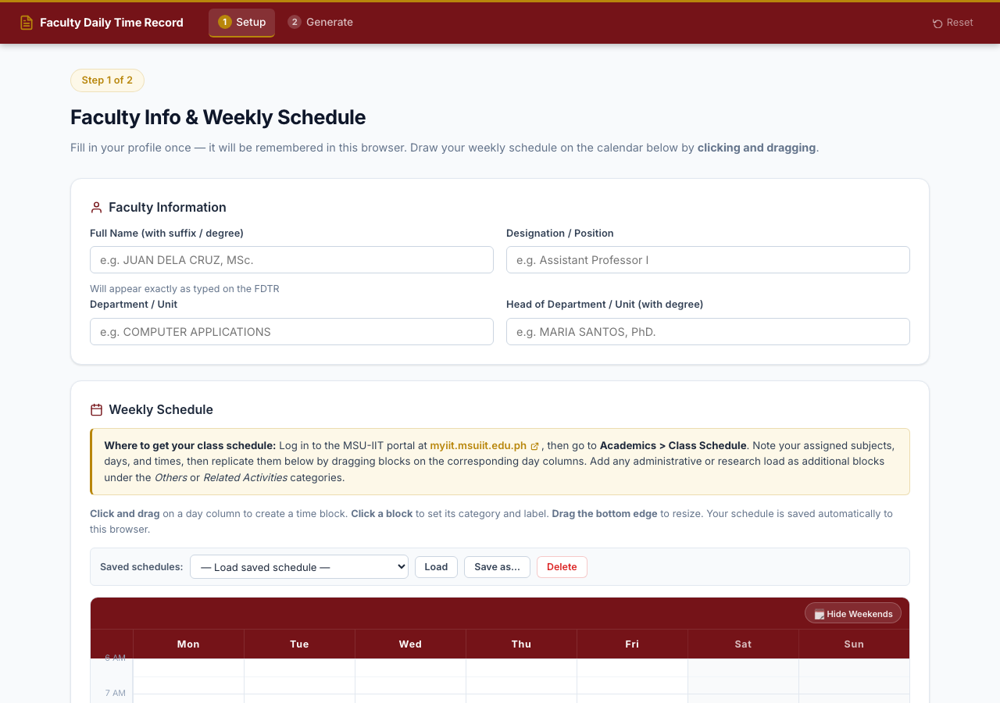
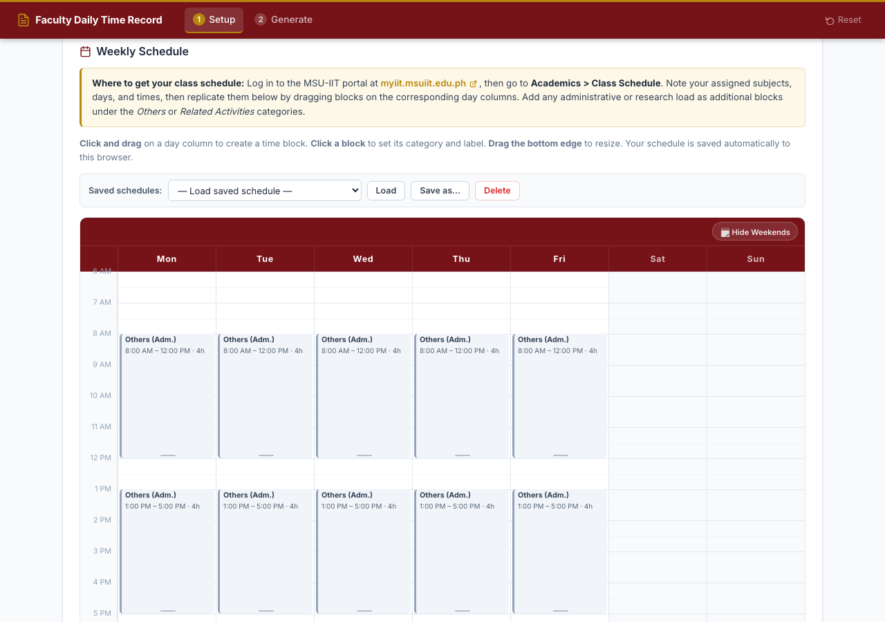
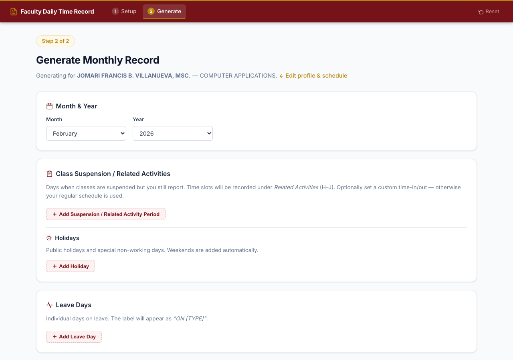
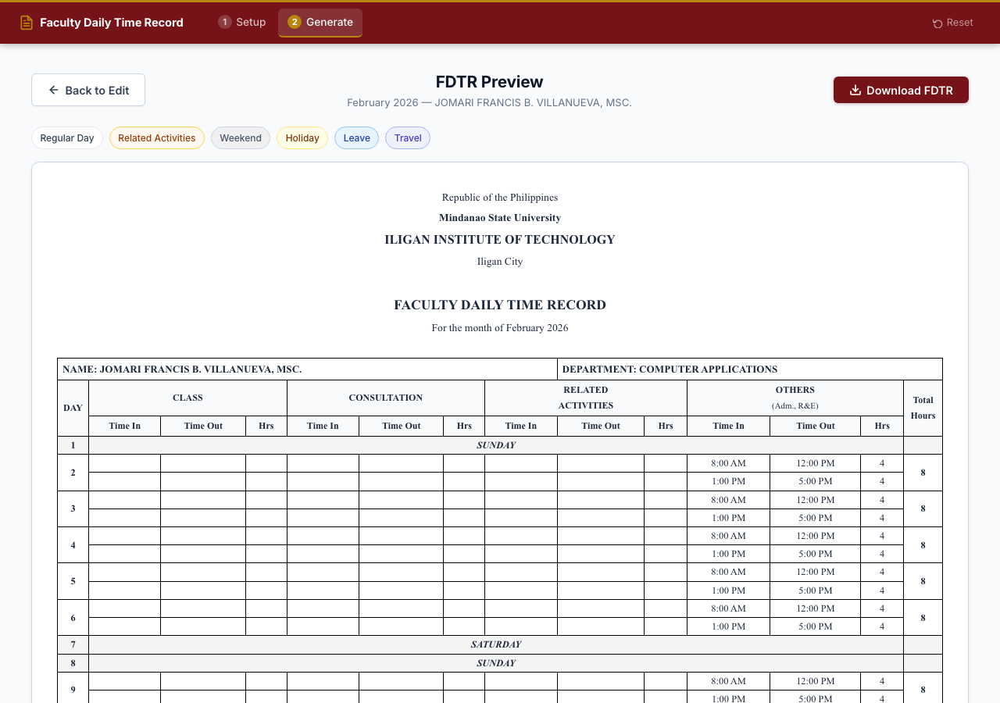
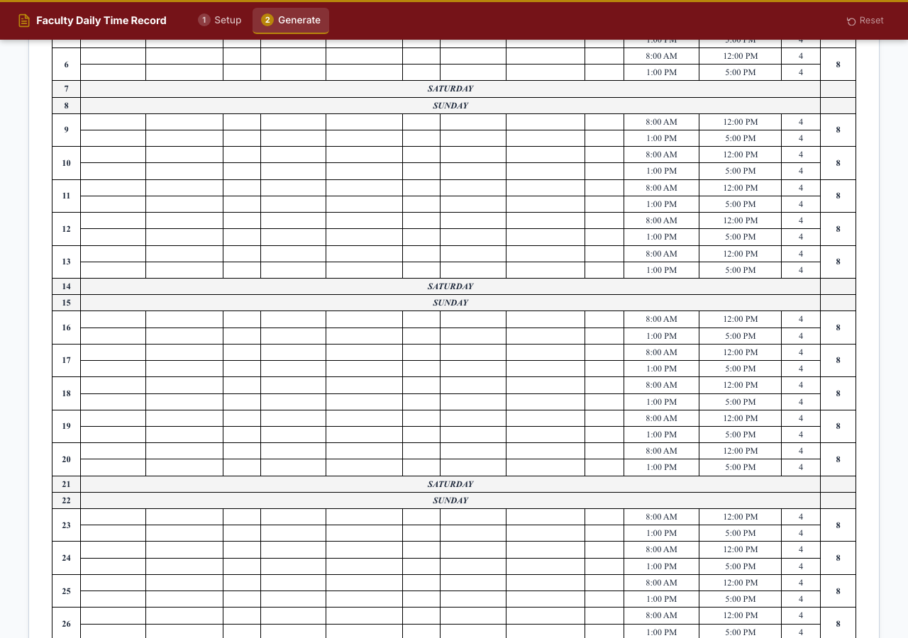

# Faculty Daily Time Record

**Faculty Daily Time Record generator for MSU-IIT faculty.**
Fill in your profile once, then generate a correctly-formatted FDTR Excel file for any month in seconds — preview it in the browser before you download.


---

## 🆕 What's New in v3.0

### Visual Calendar Scheduler
- **Drag-to-create blocks** on the weekly schedule grid — click and drag to define a time slot visually
- **Overlap layout** — side-by-side blocks render without obscuring each other
- **Inline editing** — click any block to rename its label or change its category
- **Named schedule presets** — save your current weekly schedule under a name, reload or delete it anytime from a dropdown

### Per-Month Form Memory
- Step 2 (holidays, leave, travel, suspensions) is now **saved per month/year**
- Switching between months automatically saves the current month's data and restores the selected month's data
- Empty months start blank — no accidental cross-month data bleed

### Smarter Class Suspension / Related Activities
- Suspension date ranges now **skip weekends automatically** when those days have no scheduled blocks — weekends without classes stay as plain SATURDAY / SUNDAY rows in the FDTR
- Optional **custom time-in/out** per suspension period (click *+ Add time* to expand the time fields)

### UI Improvements
- Wider **1 100 px** page container for the calendar grid
- Holidays section merged inside the Class Suspension card for a cleaner layout
- **← Back to Schedule** button on Step 2 to return without losing data
- Time-slot toggle on suspension rows hides the time inputs until needed

---

## ✨ Features

| Feature | Description |
|---|---|
| **Profile setup** | Enter your name, designation, department, and department head once — saved for the session |
| **Visual calendar scheduler** | Drag to create and resize time blocks on a Mon–Fri grid; overlap-aware layout |
| **Named schedule presets** | Save, load, and delete named weekly schedule configurations |
| **Per-month Step-2 data** | Holidays, leave, travel, and suspension data are independently persisted per month/year |
| **Holidays** | Mark public/special non-working days with a custom label |
| **Leave days** | Tag individual days as one of 17 supported leave types |
| **Official Travel** | Enter Travel Authority (TA) number and date range; all days in range are auto-labelled |
| **Class Suspension / Related Activities** | Date ranges where classes are suspended — time is logged under *Related Activities* columns; weekends without schedule blocks are automatically skipped |
| **Custom suspension times** | Optionally override time-in/out for each suspension period |
| **Live preview** | Color-coded HTML table in the browser before you download |
| **Excel output** | Exact MSU-IIT FDTR format — Times New Roman font, correct borders, column widths, merged cells |

---

## 📸 Screenshots

### Step 1 — Faculty Profile & Weekly Schedule


### Step 1 — Weekly Schedule Calendar


### Step 2 — Generate Monthly Record


### Step 3 — Preview Before Downloading




---

## 🚀 Quick Start

### Prerequisites

- Python **3.11** or later
- `pip` (comes with Python)

### 1 — Clone the repository

```bash
git clone https://github.com/JomVill/fdtr-generator.git
cd fdtr-generator
```

### 2 — Create a virtual environment

```bash
python -m venv venv
source venv/bin/activate        # macOS / Linux
# venv\Scripts\activate         # Windows
```

> **macOS note:** If your project folder path contains a colon (`:`), create the venv
> outside the project:
> ```bash
> python -m venv ~/Developer/fdtr_venv
> source ~/Developer/fdtr_venv/bin/activate
> ```

### 3 — Install dependencies

```bash
pip install -r requirements.txt
```

### 4 — Configure environment

```bash
cp .env.example .env
# Open .env and set a strong SECRET_KEY for production
```

### 5 — Run the app

```bash
python app.py
```

Open your browser at **http://localhost:5050**

---

## 🗺️ How to Use

### Step 1 — Set up your profile

Fill in your faculty information, then build your **weekly schedule** using the visual calendar.

#### Getting your class schedule from the MSU-IIT portal

Before filling in the calendar, retrieve your official class assignments:

1. Log in to the MSU-IIT portal at **[myiit.msuiit.edu.ph/my/v2/index.php](https://myiit.msuiit.edu.ph/my/v2/index.php)**
2. Navigate to **Academics > Class Schedule**
3. Note each subject's assigned **day(s)**, **time-in**, and **time-out**
4. Back in the app, replicate each class block by **dragging** on the corresponding day column in the weekly calendar
5. For **administrative load, research, or other duties** not listed under class schedule, add additional blocks manually using the *Others* or *Related Activities* category

> If your schedule includes a time slot not covered by your portal class schedule — such as department meetings, research time, or an admin assignment — use a custom block to record it accurately.

#### Using the calendar

- **Drag** on any day column to create a new time block
- **Click** an existing block to edit its label or category
- **Drag** the bottom edge of a block to resize it

Each time block belongs to one of four categories:

| Category | Excel Columns | Typical Use |
|---|---|---|
| Class | B – D | Teaching hours (replicate from portal class schedule) |
| Consultation | E – G | Student consultation |
| Related Activities | H – J | Admin work, research, etc. |
| Others (Adm., R&E) | K – M | Other duties |

**Save a preset** — give your schedule a name and reload it anytime from the *Saved schedules* dropdown.

Click **Save Profile & Continue** when done.
Your profile is **saved for the entire session** — you only need to enter it once.

---

### Step 2 — Generate a month

Select the **month** and **year**. Your inputs are **saved per month** — switching months preserves each month's data independently.

#### 📋 Class Suspension / Related Activities
For days when classes are suspended but you still report for work:
Click **+ Add Suspension / Related Activity Period** and set the date range.
Your regular weekly schedule is used, but all time slots are recorded under the **Related Activities** (H–J) columns instead of their usual columns.
- Weekends with **no scheduled blocks** are automatically skipped (they remain plain SATURDAY / SUNDAY rows).
- Click **+ Add time** to specify a custom time-in/out for that suspension period.

#### 🏖 Holidays
Click **+ Add Holiday**, pick the date, and type the label (e.g. `RIZAL DAY`).
Weekends are added automatically — you don't need to enter them.

#### 🏥 Leave Days
Click **+ Add Leave Day**, pick the date, and select the leave type from the dropdown (Sick Leave, Vacation Leave, etc.).

#### ✈️ Official Travel
Click **+ Add Travel Period**, set the date range, and enter the TA number.
Every day in the range is automatically labelled `ON TRAVEL, TA NO: …`.

Click **👁 Preview FDTR** when done.

---

### Step 3 — Preview and Download

The preview page shows a **color-coded table** that matches the Excel output:

| Color | Day Type |
|---|---|
| ⬜ White | Regular working day |
| 🟠 Light orange | Related Activities (class suspension) |
| ⬛ Light gray | Saturday / Sunday |
| 🟡 Light yellow | Holiday |
| 🔵 Light blue | Leave day |
| 💜 Light indigo | Official Travel |

If everything looks correct, click **⬇ Download FDTR** — the `.xlsx` file downloads immediately.
If you spot an error, click **← Back to Edit** to return and fix it without losing your data.

---

## 📁 Project Structure

```
fdtr-generator/
├── app.py                  # Flask routes (setup, generate, preview, download)
├── fdtr/
│   ├── __init__.py
│   └── generator.py        # Excel generation + HTML preview data
├── templates/
│   ├── base.html
│   ├── setup.html          # Step 1 — profile & weekly schedule
│   ├── generate.html       # Step 2 — month, holidays, special days
│   └── preview.html        # Step 3 — preview table + download
├── static/
│   ├── css/style.css
│   └── js/
│       ├── app.js          # localStorage persistence, dynamic rows, presets
│       └── calendar.js     # Visual calendar widget (drag-to-create, overlap layout)
├── requirements.txt
├── Procfile                # Railway.app / Heroku deployment
├── .env.example
└── LICENSE
```

---

## 📋 Changelog

### v3.0 (2026-02-28)
- **Visual calendar widget** with drag-to-create blocks and overlap layout
- **Named schedule presets** — save, load, delete weekly schedule configurations
- **Per-month Step-2 persistence** — each month/year remembers its own holidays, leave, travel, and suspension data independently
- **Weekend-skip for class suspensions** — ranges no longer override empty weekend days
- **Custom time-in/out** on suspension rows (optional toggle)
- Holidays section merged inside Class Suspension card
- Back button on Step 2 (preserves data)
- Wider 1 100 px container layout

### v2.0
- Interactive HTML preview before Excel download
- Session-resilient hidden form fields for faculty data
- Spinner overlay during preview generation
- Per-page localStorage persistence for profile and schedule

### v1.0
- Initial release — Flask app with session-based FDTR Excel generation
- Exact MSU-IIT format: merged cells, borders, Times New Roman, footer signatures

---

## ☁️ Deployment (Railway.app)

1. Push the repo to GitHub (already done).
2. Go to [railway.app](https://railway.app) → **New Project** → **Deploy from GitHub repo**.
3. Select `fdtr-generator`.
4. In the Railway dashboard, add an environment variable:
   ```
   SECRET_KEY=<your-strong-random-key>
   ```
5. Railway auto-detects the `Procfile` and deploys. Your app will be live at the assigned `.railway.app` URL.

---

## 🐛 Reporting Issues

Found a bug or have a feature request?
[**Open an issue on GitHub →**](https://github.com/JomVill/fdtr-generator/issues)

Please include:
- What you expected to happen
- What actually happened
- The month/year you were generating (if relevant)
- Any error messages shown

---

## 🤝 Contributing

Contributions that fix bugs or improve usability are welcome.

1. Fork the repository
2. Create a feature branch: `git checkout -b fix/your-fix-name`
3. Commit your changes with a clear message
4. Open a Pull Request — describe what you changed and why

All contributions remain under the [project license](LICENSE).

---

## 📜 License

**Personal Use License** — Free to use for personal, academic, or institutional purposes.
❌ Not for sale, resale, or repurposing as a commercial product.

See [LICENSE](LICENSE) for the full terms.

---

*Built for MSU-IIT faculty. Maintained by [JomVill](https://github.com/JomVill).*
